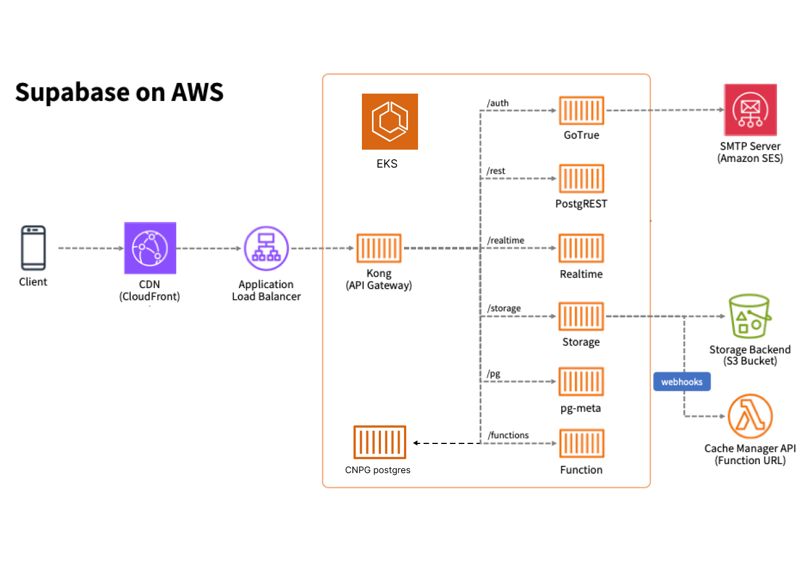
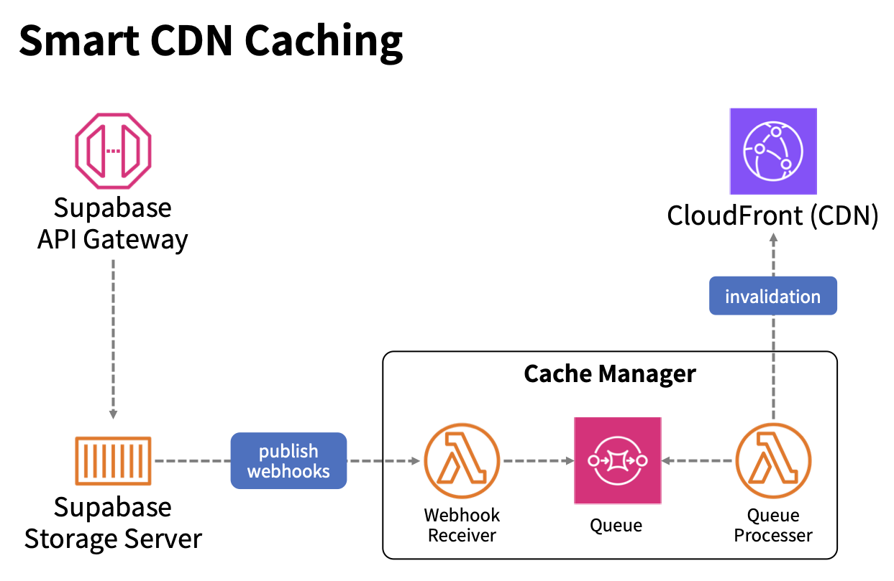

# Supabase-On-EKS CDK Template

Self-hosted Supabase on AWS Elastic Kubernates

Inspired By Supabase Community Repository 

## Architecture





## Prerequisits

## Deploy via CDK

```bash
git clone https://github.com/mats16/supabase-on-aws.git

cd infrastructure

npm install

cdk deploy SupabaseStack
```
